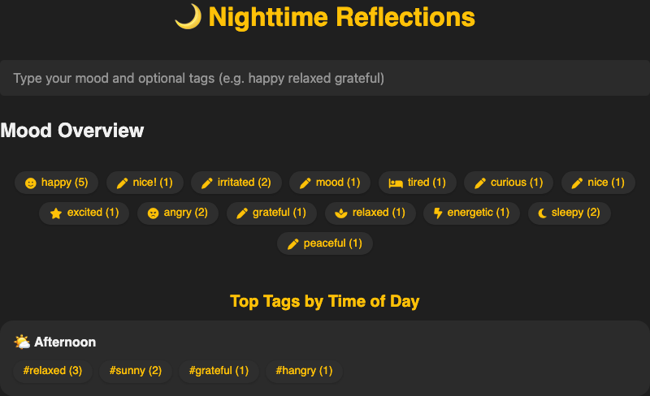

  
# 🧠 Moodmark

[]()
[](https://kotlinlang.org/)
[](https://flask.palletsprojects.com/)


A minimal, local-first mood tracking app — input a mood and tags via a simple terminal-like command bar, and instantly see visual overviews of how you're feeling over time.

---

## 💡 What It Does

- ⌨️ **Command-based input**: Type moods and tags in a clean, terminal-like bar (e.g., `happy walk music`)
- ☁️ **Mood Overview**: Visual pills showing mood names and their frequency
- 🔖 **Top Tags by Time of Day**: See which tags dominate during Morning, Afternoon, Evening, etc.
- 🎯 **Local flat storage**: No login, no cloud, all entries saved to a simple `data.json`

---

## 🔧 Stack & Runtime

- **Frontend**: HTML + CSS + Vanilla JS
- **Backend (Current)**: Python with Flask
- **Backend (Next)**: Kotlin with Ktor → builds to a `.jar`
- **Storage**: Local `data.json` file for persistence

---

## 🧭 Next Steps

- 🔄 **Backend Migration**: Migrate Flask backend to Kotlin (Ktor) and generate runnable `.jar`
- 📊 **Add JSON Visualization**: Explore and visualize mood/tag patterns directly from `data.json`
- 🧪 Optional: Hook in test data generators or mock timelines for offline experimentation

---

## 📁 Local Usage

1. Clone this repo
2. Run the Flask app:
   ```bash
   python server.py
   ```
3. Open your browser at http://localhost:5000.
4. Enter your mood commands in the input bar and watch your mood data visualized!


